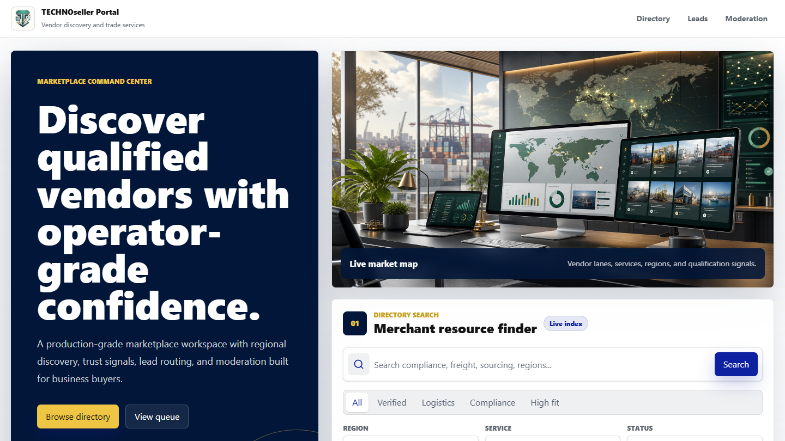

# TECHNOseller Portal

<p align="center">
  
</p>

TECHNOseller Portal is a standalone public SaaS concept for vendor discovery, service search, buyer lead capture, and marketplace moderation.

The project is inspired by the structure of an old private template archive, but it does not include or publish private archive files. All marketplace content in this repo is synthetic and safe for public demonstration.

For buyer, customer, or customization inquiries, visit [SYHTEK](https://syhtek.com).

## Buyer / Customer Notes

This project presents a production-minded marketplace concept for service discovery, vendor qualification, lead routing, and moderation. It is designed as a portfolio-ready foundation that can be adapted into a real vertical directory, B2B vendor network, procurement portal, or managed lead-generation product.

Design direction, product architecture, frontend implementation, backend API scaffolding, and public presentation by [SYHTEK](https://syhtek.com).

## What It Includes

- Responsive marketplace directory frontend
- Production React frontend powered by Vite, Tailwind CSS, Radix primitives, and lucide icons
- Node HTTP backend with JSON API endpoints
- Prisma ORM with a local SQLite database for vendors, leads, users, and demo sessions
- Original AI-generated hero, verification, and logo concept assets
- TECHNOseller palette: Tuscan Sun, Onyx, Platinum, Vivid Royal, and Prussian Blue
- Expanded synthetic vendors, services, regions, capabilities, opportunities, and moderation leads
- Premium command-style search with Radix tabs, Radix select controls, active filters, advanced drawer, and sorting
- Vendor profile routes at `/vendors/:slug`
- Demo auth page at `/login` with backend-issued dummy sessions
- Signed-in header state with avatar/profile dropdown, notifications, settings, and logout
- Operator cockpit widgets for KPIs, workflow pipeline, activity feed, and market pulse
- Buyer lead submission flow
- Admin moderation queue with lead status updates
- Demo artifact vault with downloadable verification packets, briefs, reports, and structured exports
- Architecture notes and layout schema
- Database migrations and seed scripts for local full-stack testing

## Tech Behind The Website

- React 19 and TypeScript
- Vite production build
- Tailwind CSS 4 styling system
- Radix UI primitives for tabs, dialogs, selects, and accessible controls
- Lucide icon system
- Node HTTP backend with JSON API endpoints
- Prisma ORM and SQLite local database
- Synthetic marketplace seed data layer
- API tests with Node's built-in test runner
- Static assets and screenshots prepared for GitHub presentation

## Run Locally

```bash
npm install
npm run setup
npm start
```

Or run each setup step manually:

```bash
npm run db:generate
npm run db:push
npm run db:seed
npm run build
npm start
```

Then open:

```text
http://127.0.0.1:4173
```

Use a custom port:

```bash
PORT=5000 node server.mjs
```

On PowerShell:

```powershell
$env:PORT=5000; node server.mjs
```

For split frontend/backend development:

```bash
npm run dev:backend
npm run dev:frontend
```

The Vite frontend runs separately and proxies `/api` requests to the Node backend. This keeps the future database-backed API free to evolve independently from the React frontend.

## Database

The app now runs as a full-stack local project with Prisma and SQLite. The default development database lives at `prisma/dev.db`, which is intentionally ignored by Git. Schema changes are versioned in `prisma/schema.prisma` and `prisma/migrations`.

```bash
npm run db:generate  # regenerate Prisma Client after schema changes
npm run db:push      # apply local migrations during development
npm run db:seed      # load synthetic vendors and starter moderation leads
npm run db:studio    # inspect vendors, leads, users, and sessions
```

If the backend server is already running on Windows, stop it before `npm run db:generate` so Prisma can replace its local query engine file cleanly.

For another environment, copy `.env.example` to `.env` and set `DATABASE_URL`. The schema is intentionally simple so it can later move from SQLite to Postgres with normalized service, region, verification, audit, and account tables.

## Test

```bash
npm test
```

## API

| Method | Route | Purpose |
| --- | --- | --- |
| `GET` | `/api/health` | Health check |
| `GET` | `/api/taxonomy` | Regions, services, statuses, and summary metrics |
| `GET` | `/api/artifacts` | Demo artifact metadata and download links |
| `GET` | `/api/vendors` | Searchable vendor directory |
| `GET` | `/api/vendors/:slug` | Vendor profile data |
| `GET` | `/api/auth/session` | Read current demo auth session |
| `POST` | `/api/auth/login` | Create dummy username session |
| `POST` | `/api/auth/logout` | Clear dummy auth session |
| `POST` | `/api/leads` | Submit buyer inquiry |
| `GET` | `/api/admin/leads` | Review lead queue; requires demo `admin` session |
| `PATCH` | `/api/admin/leads/:id` | Update lead moderation status; requires demo `admin` session |

## Security Notes

The backend now includes protected admin routes, database-backed demo sessions,
security headers, JSON body limits, basic rate limits, lead field validation,
and safer static file serving. See [docs/SECURITY.md](docs/SECURITY.md) for the
current posture and remaining production work.

## Privacy Position

This repo is public-safe by design:

- No private archive files are included.
- No copied legacy images are used.
- Vendor and lead data are synthetic examples.
- The included visual assets are newly generated for this project.
- Any future legacy-inspired assets should be approved, cleaned, and derivative before being committed.

## Visual Assets

Generated project assets live in `public/assets`:

- `marketplace-command-center.png`
- `verification-workflow.png`
- `technoseller-logo-concept.png`
- `operations-workspace.png`
- `compliance-review.png`
- `supplier-discovery.png`
- `lead-routing-console.png`
- `regional-network.png`

Synthetic demo artifacts live in `public/demo-artifacts`:

- `atlas-freight-verification-packet.md`
- `civitas-compliance-readiness-brief.md`
- `q2-marketplace-health-snapshot.csv`
- `supplier-shortlist-export.json`

The current screenshots in `docs/screenshots` show the enhanced desktop, mobile, and vendor profile layouts.

## Interface Direction

The frontend now uses a production-grade React/Vite/Tailwind foundation with shadcn-style component composition, Radix primitives for tabs, selects, dialogs, and dropdown menus, and denser merchant/admin patterns inspired by Square and Polaris. The directory uses a horizontal command search, saved resource views, filter chips, an advanced drawer, active pills, compact result controls, a signed-in profile menu, and rich operator widgets.

## Demo Auth

Visit `/login` and enter any username, such as `demo` or `admin`. The backend creates or updates a demo user, stores a database-backed session, and returns an HTTP-only `technoseller_session` cookie. The moderation API requires the `admin` username. This is intentionally not production authentication yet; it is a testable scaffold for future accounts, roles, and protected operator workflows.

## Future Production Path

A production version could move this concept to Next.js, Remix, or a similar full-stack framework, then add authenticated vendor accounts, Postgres, search indexing, audit trails, moderation roles, and email delivery.
